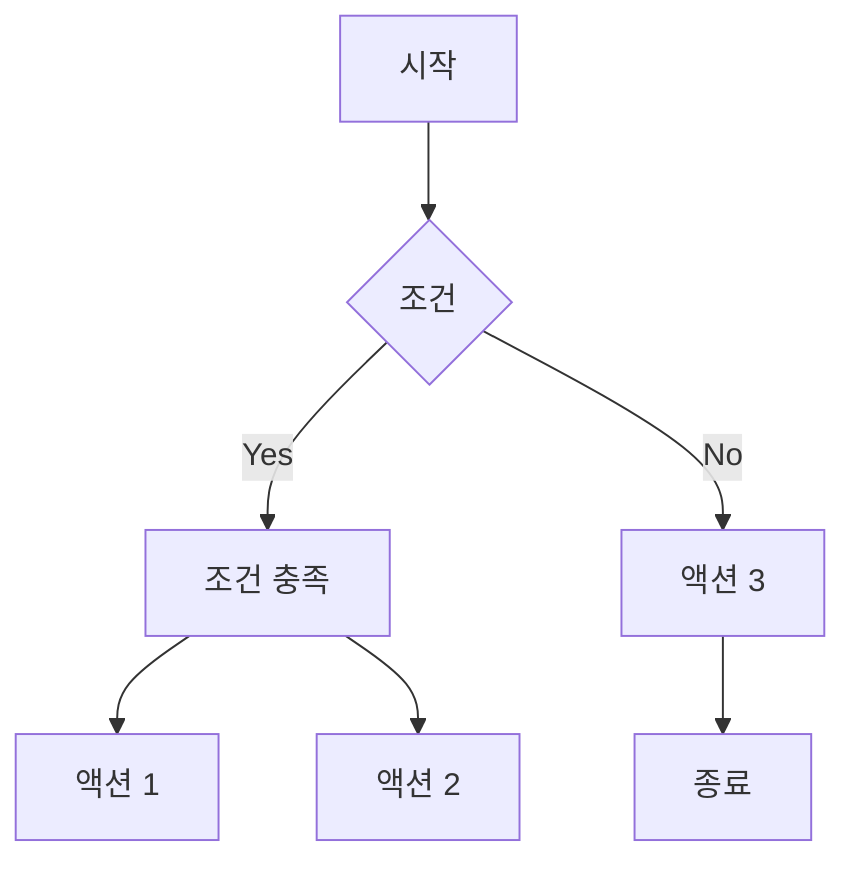

PROMPT:

mermaid 로 플로우차트 예제

RESPONSE:

물론입니다! 아래는 Mermaid를 사용하여 작성된 플로우 차트의 예제입니다.

이 예제에서는 "시작" 노드에서 시작하여 "조건" 노드로 이동합니다. "조건" 노드에서는 Yes/No로 나뉘며, 조건이 충족되면 "조건 충족" 노드로 이동하고, 그렇지 않으면 "액션 3" 노드로 이동합니다. "조건 충족" 노드에서는 "액션 1" 및 "액션 2" 노드로 이동하고, "액션 3" 노드에서는 "종료" 노드로 이동합니다.

이 예제는 간단한 조건 및 액션 흐름을 나타내는 플로우 차트입니다. Mermaid를 사용하면 이와 같은 다양한 흐름을 나타낼 수 있습니다. 실제 프로젝트에 맞게 플로우 차트를 수정하고 확장할 수 있습니다.